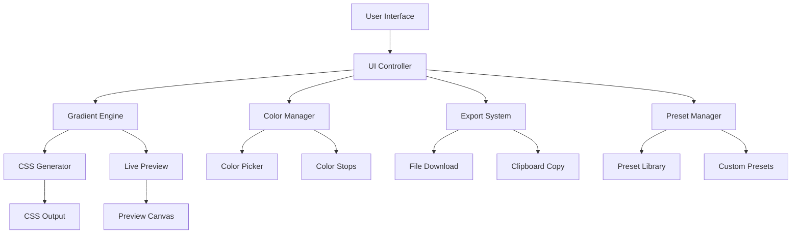

# CSS Gradient Generator - Technical Architecture

## System Overview

The CSS Gradient Generator is a client-side web application built with vanilla JavaScript, HTML5, and CSS3. It provides a comprehensive interface for creating, customizing, and exporting CSS gradients with real-time preview functionality.

## Architecture Diagram



## Core Components

### 1. UI Controller (`js/ui.js`)
**Responsibilities:**
- Manages all user interface interactions
- Coordinates between different components
- Handles event delegation and state management
- Updates UI elements based on gradient changes

**Key Methods:**
- `initializeUI()` - Sets up event listeners and initial state
- `updateControls()` - Updates control values based on gradient state
- `handleUserInput()` - Processes user interactions
- `syncUIWithGradient()` - Keeps UI in sync with gradient data

### 2. Gradient Engine (`js/gradient.js`)
**Responsibilities:**
- Core gradient calculation and management
- CSS generation for different gradient types
- Gradient property validation and normalization
- State management for gradient configuration

**Key Methods:**
- `createGradient(type, config)` - Creates new gradient instance
- `updateGradient(property, value)` - Updates gradient properties
- `generateCSS()` - Generates CSS string for current gradient
- `validateGradient()` - Validates gradient configuration

**Gradient Types Supported:**
- Linear gradients with angle/direction control
- Radial gradients with position and size options
- Conic gradients with angle and position control

### 3. Color Manager (`js/color.js`)
**Responsibilities:**
- Color picker integration and management
- Color stop creation, modification, and deletion
- Color format conversion (hex, rgb, hsl, hsv)
- Color harmony and palette suggestions

**Key Methods:**
- `addColorStop(position, color)` - Adds new color stop
- `removeColorStop(index)` - Removes color stop
- `updateColorStop(index, property, value)` - Updates color stop
- `sortColorStops()` - Maintains color stop order

### 4. Export System (`js/export.js`)
**Responsibilities:**
- CSS file generation and download
- Clipboard integration for copying CSS
- Multiple export formats (CSS, SCSS, Less)
- Export history and templates

**Key Methods:**
- `exportCSS(format)` - Exports CSS in specified format
- `downloadFile(content, filename)` - Triggers file download
- `copyToClipboard(content)` - Copies content to clipboard
- `generateStylesheet()` - Creates complete stylesheet

### 5. Preset Manager (`js/presets.js`)
**Responsibilities:**
- Built-in gradient preset library
- Custom preset creation and management
- Preset categorization and search
- Import/export of preset collections

**Key Methods:**
- `loadPresets()` - Loads built-in and custom presets
- `applyPreset(presetId)` - Applies selected preset
- `saveCustomPreset(name, gradient)` - Saves user-created preset
- `searchPresets(query)` - Searches preset library

## Data Models

### Gradient Model
```javascript
{
  type: 'linear' | 'radial' | 'conic',
  angle: number, // degrees for linear/conic
  position: { x: number, y: number }, // percentage
  size: 'closest-side' | 'farthest-side' | 'closest-corner' | 'farthest-corner',
  colorStops: [
    {
      position: number, // 0-100 percentage
      color: string, // hex, rgb, hsl format
      opacity: number // 0-1
    }
  ],
  repeating: boolean
}
```

### Color Stop Model
```javascript
{
  id: string,
  position: number, // 0-100
  color: {
    hex: string,
    rgb: { r: number, g: number, b: number },
    hsl: { h: number, s: number, l: number },
    alpha: number
  }
}
```

## User Interface Layout

### Main Layout Structure
```
┌─────────────────────────────────────────────────────────┐
│                    Header & Title                       │
├─────────────────────────────────────────────────────────┤
│  Controls Panel  │           Preview Area              │
│                  │                                     │
│  ┌─────────────┐ │  ┌─────────────────────────────────┐ │
│  │ Gradient    │ │  │                                 │ │
│  │ Type        │ │  │        Live Preview             │ │
│  └─────────────┘ │  │                                 │ │
│                  │  └─────────────────────────────────┘ │
│  ┌─────────────┐ │                                     │
│  │ Color Stops │ │  ┌─────────────────────────────────┐ │
│  │ Manager     │ │  │        CSS Output               │ │
│  └─────────────┘ │  │                                 │ │
│                  │  └─────────────────────────────────┘ │
│  ┌─────────────┐ │                                     │
│  │ Properties  │ │  ┌─────────────────────────────────┐ │
│  │ Panel       │ │  │        Export Options           │ │
│  └─────────────┘ │  └─────────────────────────────────┘ │
├─────────────────────────────────────────────────────────┤
│                    Preset Library                       │
└─────────────────────────────────────────────────────────┘
```

## Performance Considerations

### Optimization Strategies
1. **Debounced Updates**: User input is debounced to prevent excessive re-renders
2. **CSS Custom Properties**: Used for efficient style updates without DOM manipulation
3. **Event Delegation**: Single event listeners for multiple similar elements
4. **Lazy Loading**: Presets loaded on demand to reduce initial load time
5. **Memory Management**: Proper cleanup of event listeners and references

### Browser Compatibility
- **Modern Browsers**: Full feature support (Chrome 60+, Firefox 55+, Safari 12+)
- **Legacy Support**: Graceful degradation for older browsers
- **Mobile Optimization**: Touch-friendly controls and responsive design

## Security Considerations

1. **Input Validation**: All user inputs are validated and sanitized
2. **XSS Prevention**: No dynamic HTML generation from user input
3. **File Download Safety**: Generated files are created client-side only
4. **Local Storage**: Secure handling of user preferences and custom presets

## Testing Strategy

### Unit Testing
- Individual component functionality
- Gradient calculation accuracy
- Color conversion algorithms
- Export functionality

### Integration Testing
- Component interaction testing
- UI state synchronization
- Cross-browser compatibility
- Mobile device testing

### Performance Testing
- Load time optimization
- Memory usage monitoring
- Rendering performance
- Large gradient handling

## Future Enhancements

1. **Advanced Features**
   - Gradient animation support
   - SVG gradient export
   - Pattern overlays
   - Gradient blending modes

2. **User Experience**
   - Keyboard shortcuts
   - Undo/redo functionality
   - Gradient history
   - Collaborative sharing

3. **Integration Options**
   - API for external applications
   - Plugin architecture
   - Third-party tool integration
   - Cloud preset synchronization